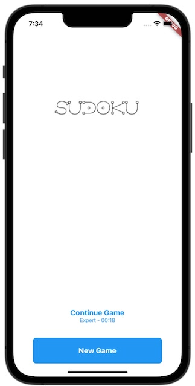
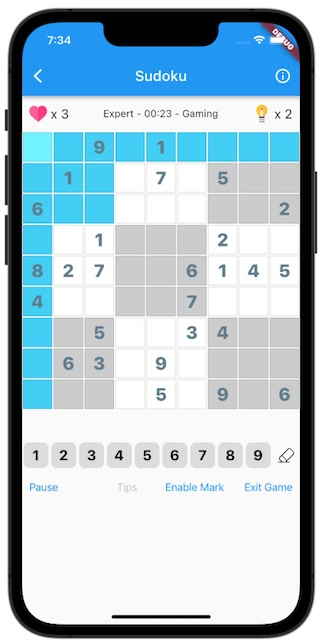

# Sudoku  

[](https://github.com/996icu/996.ICU/blob/master/LICENSE) [](https://opensource.org/licenses/Apache-2.0) [](https://badges.toozhao.com/badges/01EH7R7D3FTYMYYSYDEFCTS251/green.svg "Get your own page views count badge on badges.toozhao.com")


## about


A open source Sudoku game application powered by Flutter .

you can build the Sudoku Game just  for your own.

Download apk for android (preview) -> [github release page](https://github.com/adrien-lebreton/sudoku/releases)


## screenshots



## plan-to-do
- [:bangbang:] sudoku solver with camera scan


## environment
- dart SDK: '>=2.18.6 <3.0.0' // Null-Safety
- flutter SDK: '^3.0.0'
- jdk 17

## dependency
- [sudoku_dart](https://github.com/forfuns/sudoku-dart) (sudoku core opensource  lib  )
- [Hive](https://github.com/hivedb/hive)
- [scoped_model](https://github.com/brianegan/scoped_model)
- logger 
- sprintf

## platform support
- android
- iOS
- ~~WEB (no plan support yet)~~

## install
```shell
$> flutter pub get
# options,when you change the lib/state/sudoku_state.dart file,make sure build hive adapter for the project
$> flutter packages pub run build_runner build
```

## run
```shell
$> flutter devices
1 connected device:

iPhone SE (2nd generation) (mobile) • 09684738-362A-468F-80F2-1824A785D324 • ios • com.apple.CoreSimulator.SimRuntime.iOS-13-6 (simulator)

$> flutter run -d 09684738-362A-468F-80F2-1824A785D324
```

## pre-for-build
### android
create a keystore for apk signature

> On Windows
>
> ```shell
> keytool -genkey -v -keystore c:\Users\USER_NAME\key.jks -storetype JKS -keyalg RSA -keysize 2048 -validity 10000 -alias key
> ```
> 

> On Mac/Linux
> ```shell
> keytool -genkey -v -keystore ~/key.jks -keyalg RSA -keysize 2048 -validity 10000 -alias key
> ```

copy `./android/key.properties.example` and rename to `./android/key.properties` that contains a reference to your keystore

more information pls reference official website : https://flutter.dev/docs/deployment/android

### iOS

sign up apple developer

in Xcode,open `./ios/Runner.xcworkspace` to view your app's settings

select the `Runner` project in the Xcode project navigator. then in the main view sidebar,select the `Runner` target and select the `Identity` tab,in the `Signing` section change `Team` and `Bundle Identifier`

more information pls reference official website : https://flutter.dev/docs/deployment/ios

## build
```shell
# iOS
$> flutter build iOS
# android
$> flutter build apk
```

## release (Google Play)

Pushing a tag `vX.Y.Z` runs [`.github/workflows/release-play-store.yml`](.github/workflows/release-play-store.yml): it builds a signed app bundle and uploads it to the **internal** track of Google Play. Promote it to production from the Play Console.

```shell
$> git tag v1.0.1
$> git push origin v1.0.1
```

The tag is the source of truth for the version (the `version` in `pubspec.yaml` is ignored by the release build):

| tag | versionName | versionCode |
|---|---|---|
| `v1.0.1` | `1.0.1` | `10001` |
| `v1.2.3` | `1.2.3` | `10203` |

### one-time setup

1. Google Cloud console: enable the **Google Play Android Developer API** in a project, create a service account and download a JSON key.
2. Play Console → *Users and permissions*: invite the service account email, give it access to the app with the *Release apps to testing tracks* permission (and *Release to production* if you change the track to `production`).
3. Add the repository secrets (Settings → Secrets and variables → Actions):

| secret | value |
|---|---|
| `ANDROID_KEYSTORE_BASE64` | upload keystore, base64 encoded (`base64 -i upload-keystore.jks`) |
| `ANDROID_KEYSTORE_PASSWORD` | `storePassword` from `key.properties` |
| `ANDROID_KEY_ALIAS` | `keyAlias` from `key.properties` |
| `ANDROID_KEY_PASSWORD` | `keyPassword` from `key.properties` |
| `PLAY_SERVICE_ACCOUNT_JSON` | content of the service account JSON key |

## more flutter features
see the [Flutter](https://flutter.dev/) official website


## star history

[](https://star-history.com/#adrien-lebreton/sudoku&Date)

## the end

thanks for visit this repository , wish you can like it and star it :kissing_heart:
